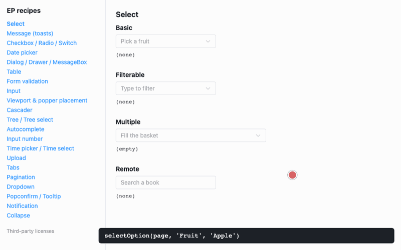

# playwright-element-plus-recipes

[English](README.md) | [简体中文](README.zh-CN.md) | [繁體中文](README.zh-TW.md) | [日本語](README.ja.md) | [한국어](README.ko.md) | **Tiếng Việt** | [Bahasa Indonesia](README.id.md) | [Bahasa Melayu](README.ms.md) | [हिन्दी](README.hi.md)

[](https://github.com/pualgao230113-sys/playwright-element-plus-recipes/actions/workflows/test.yml) [](LICENSE) [](https://pualgao230113-sys.github.io/playwright-element-plus-recipes/) [](https://www.npmjs.com/package/playwright-element-plus)

Các component của Element Plus có những hành vi làm test Playwright hỏng theo cách khó hiểu: dropdown được render ở chỗ khác trong trang, input bị ẩn, toast chồng lên nhau, giá trị chỉ được ghi nhận khi blur. Repo này có một ứng dụng demo nhỏ, mỗi component một trang, mỗi component có một spec Playwright cho thấy vấn đề xảy ra, và các helper bạn có thể dùng trong test của mình, có sẵn trên npm với tên [`playwright-element-plus`](https://www.npmjs.com/package/playwright-element-plus).

<p align="center"></p>

Demo trực tuyến: <https://pualgao230113-sys.github.io/playwright-element-plus-recipes/>

Dự án không liên kết với Element Plus hay Playwright. Các tên này chỉ được dùng để mô tả những gì dự án kiểm thử.

## Bắt đầu nhanh

```bash
git clone https://github.com/pualgao230113-sys/playwright-element-plus-recipes.git
cd playwright-element-plus-recipes
npm ci
npx playwright install chromium   # first time only
npm test                          # starts the demo app on :5179 and runs every recipe
```

| Script | Chức năng |
|---|---|
| `npm run dev` | Ứng dụng demo tại <http://localhost:5179>, mỗi recipe một trang |
| `npm test` | Toàn bộ bộ test Playwright (headless Chromium, 1 worker) |
| `npm run test:ui` | Chế độ UI của Playwright, để chạy từng bước một recipe |
| `npm run typecheck` | Kiểm tra kiểu cho ứng dụng, các spec và các helper |
| `npm run build` | Build ứng dụng demo vào `dist/` |
| `npm run build:helpers` | Build package `playwright-element-plus` vào `packages/playwright-element-plus/dist/` |

## Dùng các helper trong dự án của bạn

```bash
npm i -D playwright-element-plus
```

Dự án của bạn cần có sẵn `@playwright/test`; đây là peer dependency, đã được test với 1.63.

```ts
import { expect, test } from '@playwright/test'
import { drainMessages, message, selectOption } from 'playwright-element-plus'

test('save a fruit', async ({ page }) => {
  await page.goto('/fruits')
  await selectOption(page, 'Fruit', 'Apple')
  await drainMessages(page)
  await page.getByRole('button', { name: 'Save' }).click()
  await expect(message(page, 'Saved')).toBeVisible()
})
```

Package dùng được từ cả project test ESM lẫn CommonJS, và có kèm sẵn type. Mọi helper đều được liệt kê kèm ví dụ trong [docs/helpers.md](docs/helpers.md). README riêng của package nằm ở [packages/playwright-element-plus/README.md](packages/playwright-element-plus/README.md). Nếu không muốn thêm dependency, hãy chép [`packages/playwright-element-plus/src/index.ts`](packages/playwright-element-plus/src/index.ts) vào dự án của bạn. File này chỉ import `@playwright/test`.

### Cài bản mới nhất từ GitHub

Chỉ cần khi bạn muốn dùng thay đổi đã có trên `main` nhưng chưa phát hành lên npm.

```bash
npm i -D github:pualgao230113-sys/playwright-element-plus-recipes
```

Cách này cài repo dưới tên `playwright-element-plus-recipes`, nên hãy import từ `'playwright-element-plus-recipes'` thay vào đó. npm build các helper trong lúc cài (script `prepare` của repo), nên lần cài đầu tiên mất khoảng một phút.

pnpm chặn build script của các dependency, nên trước hết hãy cho phép package này trong `pnpm-workspace.yaml`. Với pnpm 11:

```yaml
allowBuilds:
  playwright-element-plus-recipes: true
```

Với pnpm 10, thêm vào `onlyBuiltDependencies` mục mà pnpm in ra trong lỗi `ERR_PNPM_GIT_DEP_PREPARE_NOT_ALLOWED`. Với một git dependency, mục này có kèm commit, nên nó thay đổi mỗi khi bạn cập nhật.

## Recipe

Mỗi cái bẫy được đánh dấu **Common** (phổ biến: hầu hết ứng dụng dùng component đó đều gặp) hoặc **Specific** (cụ thể: chỉ gặp với option hoặc phiên bản ghi trong ngoặc). Cái nào cũng được tái hiện bằng một test trong spec được liên kết.

Có một điều xuất hiện ở gần như mọi trang, và đó là do Playwright, không phải Element Plus: mặc định accessible name được khớp theo chuỗi con. `getByRole('option', { name: 'Apple' })` cũng tìm thấy "Pineapple", và `getByRole('button', { name: 'Delete' })` cũng tìm thấy nút "Delete book". Hãy truyền `exact: true` hoặc một RegExp có neo, và giới hạn phạm vi trong group, dialog hoặc menu khi cùng một text xuất hiện hai lần. Các spec cho thấy điều này với select ([01](tests/01-select.spec.ts)), radio group ([03](tests/03-checkbox-radio-switch.spec.ts)), dialog ([05](tests/05-dialog-drawer-messagebox.spec.ts)), tree ([11](tests/11-tree.spec.ts)), tab ([16](tests/16-tabs.spec.ts)), menu ([18](tests/18-dropdown.spec.ts)) và collapse item ([21](tests/21-collapse.spec.ts)). Các helper dùng tên chính xác.

| # | Component | Cái bẫy | Cách làm | Spec |
|---|---|---|---|---|
| 01 | `el-select` | **Common:** các option được teleport vào `<body>`, không render bên trong select.<br>**Common:** với select không filterable (mặc định), click vào `<input>` của combobox bị placeholder chặn. Input của select filterable click được, trừ các bản 2.13.3–2.14.1, nơi nó cũng bị placeholder chặn.<br>**Common:** select `multiple` vẫn mở sau mỗi lần chọn.<br>**Specific** (`remote`): dropdown bị ẩn cho đến khi có kết quả đầu tiên. | Click vào phần tử gốc `.el-select`. Lần theo `aria-controls` tới listbox của chính select đó. Nhấn Escape sau khi chọn nhiều. Chờ option xuất hiện, không chờ một khoảng thời gian cố định. | [01-select](tests/01-select.spec.ts) |
| 02 | `ElMessage` | **Common:** các toast chồng lên nhau, nên `getByRole('alert')` cũng trúng các toast cũ.<br>**Common:** `toHaveCount(0)` cũng pass với một toast đã xuất hiện rồi mờ đi. | Khớp toast theo văn bản chính xác. Gọi `drainMessages()` trước khi lặp lại một thao tác. Để chứng minh "không có toast", hãy bắt đầu `recordMessages()` trước thao tác. | [02-message](tests/02-message.spec.ts) |
| 03 | `el-checkbox` / `el-radio` / `el-switch` | **Common:** input thật bị ẩn: `check()` bị timeout và `force` fail với lỗi "outside of the viewport".<br>**Specific** (`active-text` / `inactive-text`): các text của switch là toggle, không đặt giá trị.<br>**Specific** (switch trong một `el-form-item`, click qua label của nó): `checked` gốc không khớp với `aria-checked`. | Dùng helper `setChecked()`. Helper này gọi `setChecked()` của Playwright trên `label.el-checkbox` của checkbox (checkbox thường, không phải `el-checkbox-button`). Với radio, gọi `check()` của Playwright trên `<label>` của nó bên trong `radiogroup`. Đọc trạng thái switch từ `aria-checked`, không dùng `toBeChecked()`. | [03-checkbox-radio-switch](tests/03-checkbox-radio-switch.spec.ts) |
| 04 | `el-date-picker` | **Common:** `format` (hiển thị) và `value-format` (lưu) là hai thứ khác nhau.<br>**Common:** văn bản gõ vào chỉ tới model khi nhấn Enter hoặc blur.<br>**Common:** số ngày lặp lại trong lưới (những ngày đầu của tháng sau cũng được hiển thị).<br>**Common:** lịch mở ở ngày hôm nay, nên kết quả click vào ngày phụ thuộc vào ngày hiện tại.<br>**Specific** (không có `value-format`, múi giờ phía đông UTC): ngày bị serialize thành ngày hôm trước.<br>**Specific** (gõ phím, 2.14.4+): parse dễ dãi: `3/4/2026` thành ngày 4 tháng 3, `31/02/2026` thành ngày 3 tháng 3, còn `15/3/2026` bị từ chối và giá trị cũ được giữ nguyên. | Gõ theo định dạng hiển thị, rồi kiểm tra cả input lẫn model. Cố định đồng hồ bằng `page.clock`. Chỉ chọn các ô `td.available`. Đặt `value-format` trong ứng dụng. | [04-date-picker](tests/04-date-picker.spec.ts) |
| 05 | `el-dialog` / `el-drawer` / `ElMessageBox` | **Common:** dialog đã đóng vẫn nằm trong DOM.<br>**Common:** message box được render bên ngoài `#app`.<br>**Specific** (khi assert khóa cuộn): khóa cuộn là một class trên `<body>`, chỉ bị gỡ khi dialog đã đóng xong. | Giới hạn phạm vi bằng `getByRole('dialog', { name })`. Assert `toBeHidden()`, không dùng `toHaveCount(0)`. Kiểm tra class của body bằng một `expect` có retry. | [05-dialog-drawer-messagebox](tests/05-dialog-drawer-messagebox.spec.ts) |
| 06 | `el-table` | **Common:** `getByRole('row')` đếm cả hàng header. Header cũng là một `<table>` riêng.<br>**Common:** text khi không có dữ liệu đã hiển thị sẵn bên dưới lớp loading mask.<br>**Specific** (cột sắp xếp được, 2.13.0+): nút "Sort by X" nhảy thẳng sang giảm dần, và click lần thứ hai thì bỏ sắp xếp. | Chờ `.el-loading-mask` ẩn đi. Đếm `tbody tr.el-table__row`. Đặt `class-name` riêng cho các cột và tìm hàng theo ô. Click ô header để xoay vòng, hoặc click một caret để đặt trực tiếp, rồi kiểm tra `aria-sort`. | [06-table](tests/06-table.spec.ts) |
| 07 | `el-form` | **Common:** rule `trigger: 'blur'` không làm gì cho đến khi field mất focus.<br>**Common:** dấu sao bắt buộc là một phần của accessible name (`"* Username"`).<br>**Specific** (validator bất đồng bộ): kiểm tra "không có lỗi" pass trước khi validator trả lời. | Nhấn Tab để blur. Chờ `is-success` / `is-validating`. Khớp tên bằng RegExp có neo (`/Username$/`). | [07-form-validation](tests/07-form-validation.spec.ts) |
| 08 | `el-input` | **Specific** (`maxlength`): trình duyệt cắt bớt những gì `fill()` gõ vào.<br>**Specific** (`clearable`): không click được icon xóa cho đến khi hover lên input.<br>**Specific** (`@clear`): `fill('')` không emit `clear`. | Assert giá trị đã bị cắt và bộ đếm. Hover trước khi click xóa. Click vào icon khi ứng dụng dựa vào `@clear`. | [08-input](tests/08-input.spec.ts) |
| 09 | Popper và viewport | **Common:** dropdown mở lên phía trên phần tử kích hoạt khi bên dưới không đủ chỗ, nên kết quả phụ thuộc vào chiều cao cửa sổ. | Cố định viewport trong config, dùng locator thay vì tọa độ, và kiểm tra `data-popper-placement` khi dropdown mở về phía nào là quan trọng. | [09-viewport-popper](tests/09-viewport-popper.spec.ts) |
| 10 | `el-cascader` | **Common:** input là một `textbox`, không phải combobox, và không có `aria-controls`. Panel chỉ được liên kết qua `aria-describedby` của wrapper, và chỉ khi đang mở.<br>**Common:** click vào một node cha sẽ mở cột tiếp theo nhưng không đổi model; click vào node lá mới đổi model, và đóng panel.<br>**Common:** input hiển thị label (`Fruit / Citrus / Lemon`), còn model giữ value.<br>**Specific** (`checkStrictly`): click vào label của node cha chỉ mở rộng nó; hãy click vào radio của nó.<br>**Specific** (`filterable`): kết quả là một danh sách thường gồm các đường dẫn đầy đủ, không phải menu item.<br>**Specific** (`multiple`): panel vẫn mở, và check một node cha sẽ thêm tất cả node lá của nó. | Dùng `openCascader()` / `pickCascaderPath()`. Assert cả input lẫn model. | [10-cascader](tests/10-cascader.spec.ts) |
| 11 | `el-tree` / `el-tree-select` | **Common:** các node con chưa được render cho đến khi node cha được mở rộng một lần.<br>**Common:** trong tree-select, click vào node cha sẽ mở rộng nó thay vì chọn nó.<br>**Specific** (`show-checkbox`): click vào text của node sẽ mở rộng nó, không check nó.<br>**Specific** (`show-checkbox`, một số node con được check): treeitem cha có `aria-checked="false"`; chỉ checkbox của nó ở trạng thái indeterminate, và nó không có trong `getCheckedKeys()`.<br>**Specific** (tree-select `multiple` có checkbox): model chỉ giữ key của các node lá. | Mở rộng trước (`expandTreeNode()`), check qua label của checkbox (`setTreeChecked()`), và assert `toBeChecked({ indeterminate: true })` trên checkbox. | [11-tree](tests/11-tree.spec.ts) |
| 12 | `el-autocomplete` | **Common:** phần tử có tên là một `textbox`; role `combobox` nằm trên một wrapper không có tên.<br>**Common:** các gợi ý trước đó vẫn ở trên màn hình cho đến khi debounce chạy, nên việc chờ "option X" có thể pass trên danh sách cũ.<br>**Common:** nhấn Enter khi chưa có mục nào được highlight thì không chọn gì: model là văn bản đã gõ và `select` không bao giờ được kích hoạt.<br>**Common:** gõ đầy đủ một gợi ý không giống với việc chọn nó. | Tìm listbox qua `aria-controls` của textbox (2.13.1+). Chờ toàn bộ danh sách mới bằng `toHaveText([...])`, rồi mới click. Kiểm tra rằng `select` đã được kích hoạt, và kiểm tra cả input. | [12-autocomplete](tests/12-autocomplete.spec.ts) |
| 13 | `el-input-number` | **Common:** model đi theo việc gõ, nhưng `change` chỉ được kích hoạt khi blur hoặc Enter.<br>**Common:** field nào cũng có các nút tên là "increase number" / "decrease number", và khi chạm giới hạn chúng chỉ nhận class `is-disabled`, nên `toBeDisabled()` fail.<br>**Specific** (`min` / `max`): gõ 25 vào một field có max 10 thì field hiển thị "25" trong khi model đã là 10.<br>**Specific** (xóa trống field): model trở thành rỗng, không phải `min`.<br>**Specific** (`precision` / `step-strictly`): giá trị được làm tròn khi commit (2.345 thành 2.35, 10 thành 12 với step 6). | Commit bằng Tab (`setInputNumber()`) và assert những gì field hiển thị sau đó. Giới hạn các nút trong phạm vi field (`inputNumberButton()`) và kiểm tra class. | [13-input-number](tests/13-input-number.spec.ts) |
| 14 | `el-time-picker` / `el-time-select` | **Common:** mở picker sẽ ghi thời gian hiện tại vào input và model. Escape và click ra ngoài vẫn giữ giá trị đó; chỉ Cancel mới khôi phục giá trị cũ.<br>**Common:** các item của spinner nằm ngoài phần nhìn thấy của một cột thì không click được: item đang active chặn mất cú click.<br>**Common:** `el-time-select` là một `el-select`, không phải time picker.<br>**Specific** (gõ phím): parse dễ dãi: `7:5` thành 07:05, `25:99` thành 02:39. | Cố định đồng hồ. Gõ thời gian và nhấn Enter (`typeTime()`). Dùng các helper của select cho time-select. | [14-time-picker](tests/14-time-picker.spec.ts) |
| 15 | `el-upload` | **Common:** `<input type="file">` thật có `display: none`; gọi `setInputFiles()` trực tiếp trên nó.<br>**Common:** `accept` không chặn `setInputFiles()`, nên chỉ có `before-upload` kiểm tra kiểu file.<br>**Common:** không có server thì request fail và file bị loại khỏi danh sách.<br>**Common:** mỗi item trong danh sách còn chứa một gợi ý ẩn "press delete to remove", và `toHaveText()` tính cả gợi ý này.<br>**Specific** (2.11.7+): tên của trigger khớp với hai nút.<br>**Specific** (file trong bộ nhớ): `mimeType` bạn truyền vào chính là `file.type` mà `before-upload` nhận được.<br>**Specific** (`limit`): file dư đi vào `on-exceed`; không có gì throw.<br>**Specific** (không có `multiple`): `setInputFiles()` với nhiều file sẽ throw. | Dùng `uploadInput()` và `fakeUploadEndpoint()`. Assert tên file bằng `uploadedFileNames()`. Tạo file lớn dưới dạng buffer ngay trong test. | [15-upload](tests/15-upload.spec.ts) |
| 16 | `el-tabs` | **Common:** các pane không active vẫn nằm trong DOM, chỉ bị ẩn.<br>**Specific** (`lazy`): pane chưa có trong DOM cho đến khi tab của nó được mở, sau đó thì ở lại luôn.<br>**Specific** (tab bị disable): chỉ có class `is-disabled`; cú click vẫn đi qua và không làm gì. | Assert trên `getByRole('tabpanel', { name })` và `aria-selected`. Kiểm tra class với các tab bị disable. | [16-tabs](tests/16-tabs.spec.ts) |
| 17 | `el-pagination` | **Common:** số trang là các list item có label "page N", không phải nút, và "page 1" cũng khớp với "page 10".<br>**Specific** (`jumper`): "Go to" không làm gì trong lúc bạn gõ; giá trị được áp dụng khi nhấn Enter hoặc blur, và bị giới hạn ở trang cuối.<br>**Specific** (`sizes`): select kích thước trang không có accessible name, và chọn kích thước trang lớn hơn có thể chuyển bạn sang trang khác. | Dùng `pageButton()` / `currentPage()` / `jumpToPage()`. Tìm select kích thước qua phần tử gốc của pagination. | [17-pagination](tests/17-pagination.spec.ts) |
| 18 | `el-dropdown` | **Common:** menu được teleport; `aria-controls` của trigger trỏ tới nó. Menu đã đóng vẫn nằm trong DOM.<br>**Common:** menu mở bằng hover sẽ đóng ngay khi chuột di chuyển sang chỗ khác.<br>**Specific** (`trigger="click"`): hover không làm gì.<br>**Specific** (item bị disable): cú click sẽ chờ rồi timeout; hãy assert `toBeDisabled()` thay vào đó.<br>**Specific** (`split-button`): menu mở từ một nút "Toggle Dropdown" riêng. | Dùng `openDropdown()` / `dropdownCommand()`, và đừng di chuyển chuột giữa lúc mở và lúc chọn. | [18-dropdown](tests/18-dropdown.spec.ts) |
| 19 | `el-popconfirm` / `el-tooltip` | **Common:** popconfirm có `role="tooltip"`, không phải `dialog`.<br>**Common:** nội dung của popconfirm chỉ nằm trong DOM khi nó đang mở, và tooltip cũng vậy (sau khi hover).<br>**Specific** (ứng dụng có xử lý khi cancel): chỉ nút cancel mới kích hoạt `cancel`. Click ra ngoài sẽ đóng nó mà không có `cancel`. Escape đóng nó, cũng không có `cancel`, nhưng chỉ khi focus nằm bên trong popconfirm; khi focus ở nút tham chiếu, Escape không làm gì. | Lần theo `aria-describedby` của phần tử tham chiếu (`answerPopconfirm()`). Hover trước khi assert một tooltip, và kiểm tra `toHaveAccessibleDescription()`. | [19-popconfirm-tooltip](tests/19-popconfirm-tooltip.spec.ts) |
| 20 | `ElNotification` | **Common:** notification có `role="alert"` giống toast, và chúng chồng lên nhau.<br>**Common:** nút đóng x là một `<i>` không có role.<br>**Common:** hover lên notification sẽ tạm dừng bộ đếm thời gian của nó.<br>**Specific** (trang truy vấn heading theo cấp): tiêu đề là một `<h2>`.<br>**Specific** (khi assert loại): class của loại nằm trên icon, không phải trên hộp. | Khớp theo tiêu đề (`notification()`), đóng bằng `closeNotification()`, và dùng `drainNotifications()`, helper này di chuột ra chỗ khác trước. | [20-notification](tests/20-notification.spec.ts) |
| 21 | `el-collapse` | **Common:** các item đã đóng vẫn giữ nội dung trong DOM.<br>**Common:** click vào header là toggle, nên một bước "mở ra" sẽ đóng một item đang mở sẵn.<br>**Specific** (chụp màn hình hoặc click ngay sau khi mở): nội dung được tính là visible ngay từ pixel đầu tiên của animation. | Kiểm tra `aria-expanded` trước khi click (`setCollapseItem()`), và chờ animation kết thúc. | [21-collapse](tests/21-collapse.spec.ts) |

## Phiên bản đã kiểm thử

Vue 3.5.43, @playwright/test 1.63.0 (Chromium headless shell), Vite 8.3.3, Node.js 24.

Mỗi phiên bản Element Plus dưới đây được cài riêng và chạy toàn bộ bộ test trên đó (111 test). Ở chỗ hành vi thay đổi giữa các phiên bản, spec sẽ skip với lý do ghi rõ phiên bản, hoặc assert đúng giá trị cho từng phiên bản. CI chạy ba phiên bản được hỗ trợ.

| Element Plus | Kết quả | Ghi chú |
|---|---|---|
| 2.14.7 | 111 pass | Mọi recipe đều áp dụng. |
| 2.13.7 | 109 pass, 2 skip | Chưa có parse ngày dễ dãi (04), chưa có `role="status"` trên bộ đếm của input (08). |
| 2.9.11 | 104 pass, 7 skip | Thêm nữa: chưa có nút "Sort by" hay `aria-sort` trong table (06), và `aria-controls` của autocomplete không trỏ tới listbox của nó (12). |
| 2.7.8 | Không hỗ trợ: 13 fail, 7 skip | Input của date picker và time picker không có role `combobox`, nên các helper của chúng không tìm thấy gì. Ngoài ra, placeholder của select filterable vẫn chặn click vào input của nó (01), và click ra ngoài không đóng popconfirm (19). |
| 2.4.4 | Không hỗ trợ: 19 fail, 7 skip | Cùng các lỗi ở date picker, time picker và popconfirm như 2.7.8, thêm 7 lỗi nữa ở select, checkbox / radio, dialog, tree-select và pagination (ví dụ: placeholder của select hoàn toàn không chặn click vào input của nó). |

Mỗi thay đổi xuất hiện từ phiên bản nào, để bạn biết ghi chú nào áp dụng cho phiên bản của mình:

| Từ | Thay đổi | Recipe |
|---|---|---|
| 2.11.7 | Wrapper của trigger upload có `role="button"`, nên tên của trigger khớp với hai nút. | 15 |
| 2.12.0 | Icon đóng của tag trong select multiple trở thành một nút tên là "Close this tag". Spec dùng `.el-tag__close`, cách này chạy được ở mọi phiên bản. | 01 |
| 2.13.0 | Header sắp xếp được có `aria-sort` và một nút "Sort by X". | 06 |
| 2.13.1 | `aria-controls` của textbox autocomplete trỏ tới listbox. Trước đó, nó là đúng chuỗi `"id"`. | 12 |
| 2.13.3–2.14.1 | Input của select filterable cũng bị placeholder chặn. Đã sửa ở 2.14.2. | 01 |
| 2.13.4 | Cancel trên một time picker trống để lại `null` trong model. Trước đó là chuỗi rỗng. | 14 |
| 2.14.0 | Icon xóa của input vẫn nằm trong DOM khi bị ẩn. Trước đó, nó chỉ được render khi hover. Dù thế nào, hãy hover trước. | 08 |
| 2.14.4 | Ngày gõ vào được parse dễ dãi (`3/4/2026` thành ngày 4 tháng 3). Trước đó, `3/4/2026` bị từ chối. | 04 |
| 2.14.5 | Bộ đếm word-limit có `role="status"`. Trước đó, dùng `.el-input__count`. | 08 |

## Giới hạn và khác biệt đã biết

- Chỉ Chromium. Các recipe chưa được chạy trên Firefox hay WebKit.
- Phần lớn các hành vi này là chi tiết triển khai của Element Plus, không phải API có tài liệu. Nếu một recipe bắt đầu fail sau khi nâng cấp, nghĩa là có gì đó đã thay đổi. Hãy kiểm tra recipe trước khi viết lại test của bạn.
- Các helper khớp với các text tiếng Anh mà ứng dụng demo hiển thị ("increase number", "page N", "Yes" / "No"). Nếu ứng dụng của bạn dùng locale khác, hãy truyền tên của riêng bạn hoặc chỉnh lại helper.
- Các trang demo được làm nhỏ có chủ ý. Ứng dụng thật có thêm timing riêng (gọi API, transition của chính bạn), nên hãy luôn chờ kết quả, không chờ thời gian.

## Đóng góp

Xem [CONTRIBUTING.md](CONTRIBUTING.md). Quy tắc chính: một cái bẫy chỉ được thêm vào nếu có test tái hiện nó trên thư viện thật.

## Giấy phép

[MIT](LICENSE) © 2026 Paul Gao

## Bản dịch

README tiếng Anh là bản tham chiếu. Mọi chỉnh sửa cho các bản dịch đều được hoan nghênh qua pull request.
